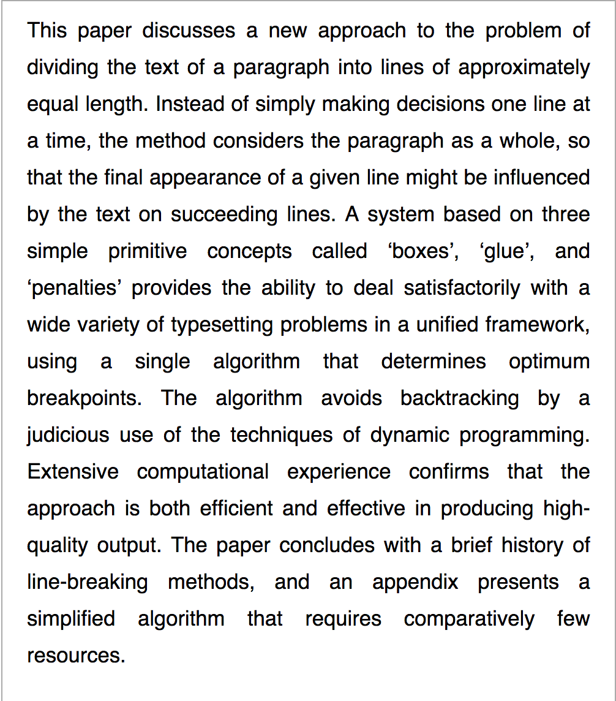
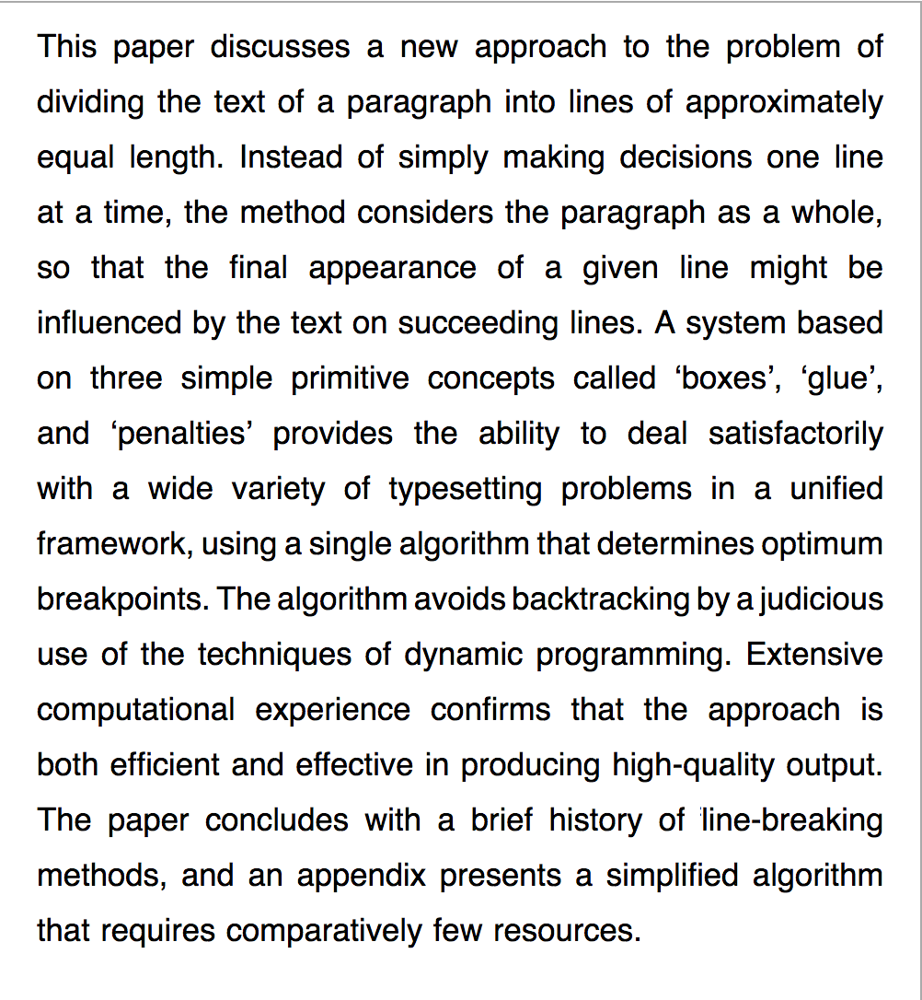

# tex-linebreak


_tex-linebreak_ is a JavaScript library for laying out justified text as you
would find in a newspaper, book or technical paper.

It implements the Knuth-Plass line-breaking algorithm, as used by TeX. Compared
to standard methods of justifying text (eg.  `text-align: justify` in CSS) this
method produces more optimal spacing with fewer lines having spacing between
words that is too tight or too loose, both of which are difficult to read.

_tex-linebreak_ has no dependencies on a particular JS environment (browser,
Node) or render target (`<canvas>`, HTML elements, PDF).

<table>
  <tr>
    <td>CSS `text-align: justify` (Firefox 61)</td>
    <td>_tex-linebreak_ output rendered</td>
  </tr>
  <tr>
    <td></td>
    <td></td>
  </tr>
  <tr>
    <td>Text justified using the browser's `text-align` option
        can have a large amount of inter-word spacing in places.
        This depends on the browser's implementation, but it affects
        Safari, Firefox and Chrome to varying degrees.</td>
    <td>The TeX algorithm in contrast minimizes the amount of
        stretching/shrinking of spaces required over the whole paragraph,
        producing fewer large gaps and making the output more comfortable
        to read.</td>
  </tr>
</table>

## Usage

First, add the _tex-linebreak_ package to your dependencies:

```sh
npm install tex-linebreak
```

The library has low-level APIs which implement the core line-breaking and
positioning algorithm, as well as higher-level APIs that are convenient to use
when laying out text.

### Low-level APIs

The low-level APIs `breakLines` and `positionItems` work with generic "box"
(typeset material), "glue" (spaces with flexible sizing) and "penalty" items.
Typically "boxes" are words, "glue" items are spaces and "penalty" items
represent hyphenation points or the end of a paragraph. However you can use them
to lay out arbitrary content.

```js
import { layoutItemsFromString, breakLines, positionItems } from 'tex-linebreak';

// Convert your text to a set of "box", "glue" and "penalty" items used by the
// line-breaking process.
//
// "Box" items are things (typically words) to typeset.
// "Glue" items are spaces that can stretch or shrink or be a breakpoint.
// "Penalty" items are possible breakpoints (hyphens, end of a paragraph etc.).
//
// `layoutItemsFromString` is a helper that takes a string and a function to
// measure the width of a piece of that string and returns a suitable set of
// items.
const measureText = text => text.length * 5;
const items = layoutItemsFromString(yourText, measureText);

// Find where to insert line-breaks in order to optimally lay out the text.
const lineWidth = 200;
const breakpoints = breakLines(items, lineWidth)

// Compute the (xOffset, line number) at which to draw each box item.
const positionedItems = positionItems(items, lineWidth, breakpoints);

positionedItems.forEach(pi => {
  const item = items[pi.item];

  // Add code to draw `item.text` at `(box.xOffset, box.line)` to whatever output
  // you want, eg. `<canvas>`, HTML elements with spacing created using CSS,
  // WebGL, ...
});
```

### High-level APIs

The high-level APIs provide convenience methods for laying out text into lines,
as well as using hyphenation if necessary. _tex-linebreak_ does not provide
hyphenation of words itself, but you can use an existing package such as
[hypher](https://github.com/bramstein/hypher).

```js
import { layoutText } from 'tex-linebreak';

import Hypher from 'hypher';
import enUsPatterns from 'hyphenation.en-us';

const hyphenate = word => hyphenator.hyphenate(word);
const measure = word => word.length * 5;

const { items, positions } = layoutText(text, lineWidth, measure, hyphenate);

positions.forEach(pos => {
  // Draw text as in the above example for the low-level APIs
});
```

## API reference

The source files in [src/](src/) have documentation in the form of TypeScript
annotations.

## Examples

For working code showing different ways to use this library, see [the
demos](src/demos/). You can build and run the demos using:

```
npm i -g http-server

git clone https://github.com/robertknight/tex-linebreak.git
cd tex-linebreak
yarn
yarn build-demos
http-server -c-1
```

Then navigate to http://127.0.0.1:8080/src/demos/layout.html (note that
http-server may choose a different port).

## References

[1] D. E. Knuth and M. F. Plass, “[Breaking paragraphs into lines](http://www.eprg.org/G53DOC/pdfs/knuth-plass-breaking.pdf),” Softw. Pract. Exp., vol. 11, no. 11, pp. 1119–1184, Nov. 1981.
